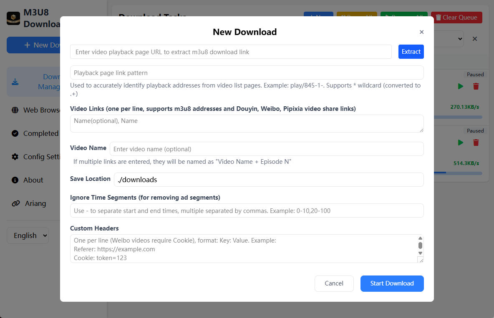
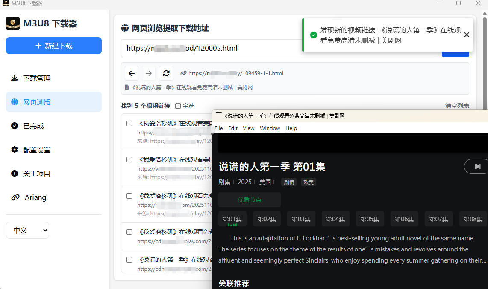
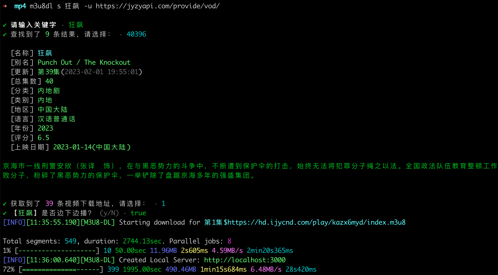
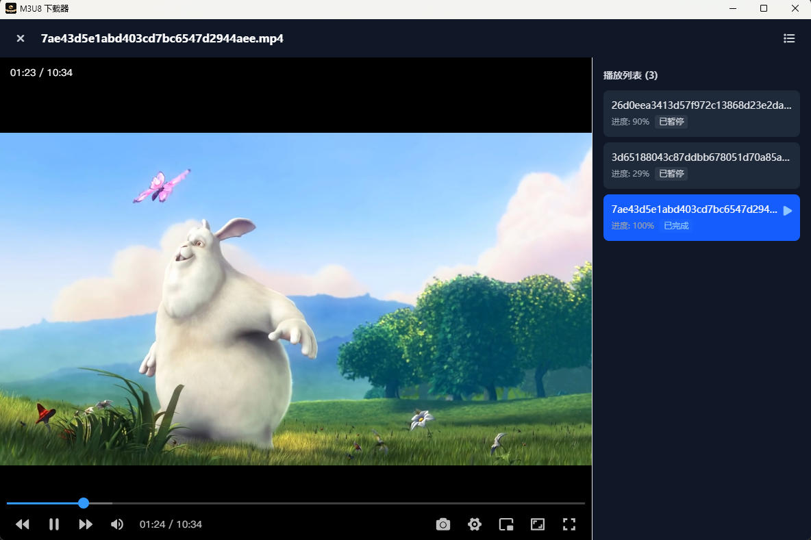

[][npm-url]

# @lzwme/m3u8-dl

[![NPM version][npm-badge]][npm-url]
[![node version][node-badge]][node-url]


[](https://github.com/lzwme/m3u8-dl/actions/workflows/node-ci.yml)
[![npm download][download-badge]][download-url]
[![GitHub issues][issues-badge]][issues-url]
[![GitHub forks][forks-badge]][forks-url]
[![GitHub stars][stars-badge]][stars-url]

> **Language**: [English](README.md) | [中文简体](README.zh-CN.MD)

A free, open-source, and powerful m3u8 video batch downloader with multi-threaded downloading, play-while-downloading, WebUI management, video parsing, and more. Supports multiple usage methods including CLI command line, browser, PC client, Docker deployment, and Node.js API calls.

## ✨ Features

### 🚀 Core Download Features

- **Multi-threaded Downloading**: Uses thread pool mode with customizable thread count, significantly improving download speed
- **Play-While-Downloading Mode**: Supports online playback using downloaded ts cache files without waiting for complete download
- **Batch Downloading**: Supports batch downloading of multiple m3u8 addresses, supports batch import from text files
- **Resume from Cache**: Failed downloads retain cache, retries only download failed segments, saving bandwidth and time
- **AES Encryption Support**: Automatically identifies and decrypts common AES-128 encrypted video streams
- **Format Conversion**: Automatically merges and converts downloaded ts segments to mp4 format (requires [ffmpeg](https://ffmpeg.org/download.html))
- **Multi-format Support**: Supports downloading video files in mp4, mkv, and other formats
- **Segment Filtering**: Supports ignoring video segments in specified time ranges (e.g., skip intro and outro)

### 🌐 WebUI Download Management

- **Modern Interface**: Modern web interface built with Vue 3 + TypeScript
- **Real-time Progress**: Real-time display of download progress and status via WebSocket
- **Task Management**: Supports pausing, resuming, and deleting download tasks, supports batch operations
- **Download Center**: Centralized management of all download tasks, supports search and filtering
- **Configuration Management**: Visual configuration of download parameters (thread count, save directory, etc.)
- **Access Control**: Supports setting access password (token) to protect the service



### 🎬 Video Parsing Features

- **Multi-platform Support**: Supports parsing video sharing links from platforms like Douyin, Weibo, Pipixia, etc.
- **Watermark-free Download**: Automatically extracts watermark-free video addresses and downloads
- **Smart Recognition**: Automatically recognizes video platforms and selects appropriate parsers

### 🔍 Smart m3u8 Address Extraction

- **Web Page Extraction**: Supports automatic extraction of m3u8 addresses from video playback pages
- **Deep Search**: Supports multi-level page search, automatically discovers video links
- **Batch Extraction**: Extract multiple video links at once, supports batch downloading



### 🎯 Browser Userscript Capture Tool

- **Auto Capture**: Automatically intercepts and captures m3u8 and mp4 video links in web pages
- **Real-time Monitoring**: Monitors network requests (XMLHttpRequest, fetch, Performance API), automatically discovers video links
- **Smart Recognition**: Automatically recognizes video types (M3U8/MP4) and extracts video names
- **One-click Jump**: Supports one-click jump to m3u8-dl WebUI for downloading
- **Flexible Configuration**: Supports configuring exclusion URL rules to avoid capturing on specific pages
- **Draggable Panel**: Supports dragging to move panel position, automatically saves position
- **Link Management**: Supports copying links, clearing list, and other operations

> This is a Tampermonkey/Greasemonkey userscript that can automatically capture video links in browsers, working with m3u8-dl WebUI to provide a seamless download experience.

### 📺 Video Search Features

- **Collection Site Support**: Supports standard collection site APIs, search and download through command-line interaction
- **Cache Mechanism**: Automatically caches search history, supports continuing unfinished downloads



### ▶️ Video Playback

- **Built-in Player**: Both WebUI and desktop client have built-in lightweight video players, can directly play downloaded or downloading videos online without waiting for completion.
- **Play-While-Downloading**: Supports automatic splicing of ts cache segments, can play while downloading, achieving "download and watch" experience.
- **Multi-format Support**: Player supports playback of mainstream video formats like mp4, ts, with drag, speed control, fullscreen, picture-in-picture, and other operations.
- **History**: Automatically records playback progress, supports resume playback, convenient for long video series watching.

> No need to rely on third-party players, you can directly watch downloaded content in the browser or client, improving convenience.



### 💻 Multiple Usage Methods

- **Command Line Tool**: Provides complete CLI commands with various parameter configurations
- **Node.js API**: Provides programming interface for easy integration into other projects
- **Web Service**: Supports starting as a web service, manage downloads through browser
- **Docker Deployment**: Provides Docker image for one-click deployment to server
- **Electron Desktop App**: Supports packaging as desktop application with built-in browser functionality

### 🌍 Internationalization Support

- Supports Chinese and English multi-language
- Both command line and WebUI support language switching

## 📦 Installation

**Method 1: Global Installation with Node.js**

Use as a CLI command-line tool.

```bash
npm i -g @lzwme/m3u8-dl
m3u8dl -h
```

Or use `npx` to run directly:

```bash
npx @lzwme/m3u8-dl -h
```

**Method 2: Desktop Application Download**

Install as a PC client. Easy to use, suitable for most regular users, with built-in browser functionality to automatically extract video addresses. Download the latest version from one of the following addresses:

- [https://m3u8-player.lzw.me/download.html](https://m3u8-player.lzw.me/download.html)
- [https://github.com/lzwme/m3u8-dl/releases](https://github.com/lzwme/m3u8-dl/releases)

## 📖 Usage Guide

> **Tip**: If you need to download and convert to `mp4` video format, you need to globally install [ffmpeg](https://ffmpeg.org/download.html).
> Or use the `--ffmpeg-path` parameter to specify the path to ffmpeg.

### Using as CLI Command Line Tool

View all available commands and options:

```bash
m3u8dl --help
```

#### Basic Download

```bash
# Download a single m3u8 file
m3u8dl https://example.com/video.m3u8

# Specify filename and save directory
m3u8dl https://example.com/video.m3u8 --filename "My Video" --save-dir "./downloads"

# Enable play-while-downloading mode
m3u8dl https://example.com/video.m3u8 --play

# Set thread count (default 4)
m3u8dl https://example.com/video.m3u8 --thread-num 8

# Don't convert to mp4 (only download ts segments)
m3u8dl https://example.com/video.m3u8 --no-convert

# Ignore specified time segments (e.g., skip first 30 seconds and last 60 seconds)
m3u8dl https://example.com/video.m3u8 --ignore-segments "0-30,END-60"
```

#### Batch Download

**Method 1: Command Line Parameters**

```bash
# Download multiple files, use | to separate filename and URL
m3u8dl "Episode 1|https://example.com/ep1.m3u8" "Episode 2|https://example.com/ep2.m3u8" --filename "Series Name"
```

**Method 2: Batch Import from Text File**

Create a `series-list.txt` file with the following format (use `$` to separate filename and URL):

```txt
Episode 1$https://example.com/ep1.m3u8
Episode 2$https://example.com/ep2.m3u8
Episode 3$https://example.com/ep3.m3u8
```

Then execute:

```bash
m3u8dl series-list.txt --filename "Series Name"
```

#### Video Parsing Download

Supports sharing links from platforms like Douyin, Weibo, etc.:

```bash
# Douyin video sharing link
m3u8dl "https://v.douyin.com/xxxxx/" --type parser

# Weibo video sharing link
m3u8dl "https://weibo.com/xxxxx" --type parser
```

#### Extract m3u8 Address from Web Page

```bash
# Automatically extract m3u8 address from video playback page and download
m3u8dl "https://example.com/play/12345" --type web
```

#### Video Search Download

```bash
# View search command help
m3u8dl search --help

# Specify collection site API and search download (will cache API address)
m3u8dl search -u https://api.example.com/provide/vod/

# Search keyword directly
m3u8dl search "keyword" -u https://api.example.com/provide/vod/
```

> **Disclaimer**: The above are examples only. Please search for available collection site APIs yourself. This tool is only for technical research and learning purposes and does not provide any specific resource information.

#### Common Command Line Options

| Option | Description |
|--------|-------------|
| `-f, --filename <name>` | Specify filename |
| `-n, --thread-num <number>` | Set download thread count (default 4) |
| `-p, --play` | Enable play-while-downloading mode |
| `-C, --cache-dir <dirpath>` | Specify cache directory |
| `-S, --save-dir <dirpath>` | Specify save directory |
| `--no-convert` | Don't convert to mp4 |
| `--no-del-cache` | Don't delete cache after download completes |
| `--ffmpeg-path <path>` | Specify ffmpeg path |
| `-H, --headers <headers>` | Set request headers (JSON format) |
| `-I, --ignore-segments <time>` | Ignore specified time segments |
| `--debug` | Enable debug mode |
| `--lang <lang>` | Set language (zh-CN/en) |

### WebUI Download Management

Start web service to manage download tasks through browser:

```bash
# Start service (default port 6600)
m3u8dl server

# Specify port and access password
m3u8dl server -p 8080 -t "your-secret-token"
```

After starting, visit `http://localhost:6600` in your browser to use WebUI.

**WebUI Main Features:**

- 📥 Create download tasks (supports m3u8 links, Weibo and Pipixia video sharing links, video playback page extraction)
- 📊 View download progress and speed in real-time
- ⏸️ Pause/Resume download tasks
- 🗑️ Delete tasks and downloaded files
- ⚙️ Configure download parameters (thread count, save directory, etc.)
- 🔍 Search and filter tasks
- 📁 View completed downloads

**Environment Variable Configuration:**

```bash
# Set port
export DS_PORT=6600

# Set access password
export DS_SECRET=your-secret-token

# Set save directory
export DS_SAVE_DIR=./downloads

# Set cache directory
export DS_CACHE_DIR=./cache

# Set ffmpeg path
export DS_FFMPEG_PATH=/usr/local/bin/ffmpeg

# Enable debug mode
export DS_DEBUG=1

# Limit file access (only allow access to download and cache directories)
export DS_LIMTE_FILE_ACCESS=1
```

### Integration as Node.js API

Call related APIs in your project. Code examples:

```ts
import { m3u8Download, m3u8BatchDownload, VideoParser, getM3u8Urls } from '@lzwme/m3u8-dl';

// Example 1: Single file download
const result = await m3u8Download('https://example.com/video.m3u8', {
  filename: 'My Video',
  saveDir: './downloads',
  threadNum: 8,
  debug: true,
});

if (result.errmsg) {
  console.error('Download failed:', result.errmsg);
} else {
  console.log('Download successful:', result.filepath);
}

// Example 2: Batch download
const fileList = [
  'Episode 1$https://example.com/ep1.m3u8',
  'Episode 2$https://example.com/ep2.m3u8',
];
await m3u8BatchDownload(fileList, {
  filename: 'Series Name',
  threadNum: 4,
});

// Example 3: Video parsing download (Douyin, Weibo, etc.)
const parser = new VideoParser();
const parseResult = await parser.parse('https://v.douyin.com/xxxxx/');
if (parseResult.data) {
  console.log('Video title:', parseResult.data.title);
  console.log('Video URL:', parseResult.data.url);

  // Download video
  await parser.download('https://v.douyin.com/xxxxx/', {
    filename: parseResult.data.title,
  });
}

// Example 4: Extract m3u8 addresses from web page
const urls = await getM3u8Urls({
  url: 'https://example.com/play/12345',
  headers: {
    'User-Agent': 'Mozilla/5.0...',
  },
  deep: 2, // Search depth
});
console.log('Extracted addresses:', Array.from(urls.keys()));

// Example 5: Specify ffmpeg path
import ffmpegStatic from 'ffmpeg-static';
m3u8Download('https://example.com/video.m3u8', {
  filename: 'Test Video',
  ffmpegPath: ffmpegStatic, // Use ffmpeg-static package. Suitable for scenarios where ffmpeg is not globally installed
  // Or specify the absolute path of installed ffmpeg (if already in PATH environment variable, no need to specify)
  // ffmpegPath: '/usr/local/bin/ffmpeg',
});
```

### Docker Deployment

#### Using Docker Command

```bash
# Pull image
docker pull renxia/m3u8dl-dl:latest

# Run container
docker run --rm -it \
  -v ./cache:/app/cache \
  -v ./downloads:/app/downloads \
  -p 6600:6600 \
  -e DS_PORT=6600 \
  -e DS_SECRET=your-secret-token \
  renxia/m3u8dl-dl:latest
```

#### Using Docker Compose

Create `docker-compose.yml` file:

```yml
services:
  m3u8-dl:
    image: renxia/m3u8dl-dl:latest
    container_name: m3u8-dl
    volumes:
      - ./downloads:/app/downloads
      - ./cache:/app/cache
    ports:
      - '6600:6600'
    environment:
      DS_PORT: '6600'
      DS_SAVE_DIR: '/app/downloads'
      DS_CACHE_DIR: '/app/cache'
      DS_SECRET: '' # Set access password
      DS_DEBUG: ''
      DS_FFMPEG_PATH: ''  # Leave empty to use ffmpeg from system PATH
      DS_LIMTE_FILE_ACCESS: '1' # Limit file access
    restart: unless-stopped
```

Start service:

```bash
docker-compose up -d
```

After successful deployment, visit `http://your-server-ip:6600` in your browser to use.

> **Tip**: The Docker image already includes ffmpeg, no need for additional installation. The image also includes [AriaNg](https://github.com/mayswind/AriaNg) static resources.

### Electron Desktop Application

The project supports packaging as an Electron desktop application with richer features:

- 🖥️ Native desktop experience
- 🌐 Built-in browser, supports extracting video links from web pages
- 📱 System tray support
- 🔄 Auto-update functionality

Download the built application:

- https://m3u8-player.lzw.me/download.html
- https://github.com/lzwme/m3u8-dl/releases

### Browser Script Installation and Usage

**Installation Steps:**

1. Install browser extension (choose one):
   - [Violentmonkey](https://violentmonkey.github.io/) (【Recommended】Open-source alternative)
   - [Tampermonkey](https://www.tampermonkey.net/) (【Official】Supports Chrome, Firefox, Edge, Safari, etc.)
   - [Greasemonkey](https://www.greasespot.net/) (Firefox only)

2. Install script:
   - Open Tampermonkey management panel
   - Click "Add new script"
   - Copy content from `client/m3u8-capture.user.js` file
   - Paste into editor and save
   - Or directly visit the link in browser: [https://raw.githubusercontent.com/lzwme/m3u8-dl/refs/heads/main/client/m3u8-capture.user.js](https://raw.githubusercontent.com/lzwme/m3u8-dl/refs/heads/main/client/m3u8-capture.user.js)

3. Configure WebUI address:
   - Visit any web page, click the 🎬 icon in the top right corner to open the capture panel
   - Click the settings button ⚙️
   - Enter your m3u8-dl WebUI address (e.g., `http://localhost:6600`)
   - Save settings

**Feature Description:**

- **Auto Capture**: The script automatically monitors network requests in web pages, when m3u8 or mp4 video links are detected, automatically adds them to the list
- **Video Name Extraction**: Prioritizes extracting video names from page `h1`, `h2`, or `document.title`
- **Jump to Download**: Click the "Jump to Download" button to automatically jump to m3u8-dl WebUI and fill in video link and name (format: `url|name`)
- **Exclusion Rules**: In settings, you can configure exclusion URL rule list, matching URLs will not show panel and will not capture video links
  - Supports plain string matching (contains match)
  - Supports regular expressions (starts and ends with `/`, e.g., `/example\.com/`)

**Usage Example:**

1. Visit video playback page
2. Script automatically captures video links, displayed in the panel in the bottom right corner
3. Click "Jump to Download" button
4. Automatically jumps to m3u8-dl WebUI, video link and name are automatically filled
5. Click "Start Download" in WebUI

**Exclusion Rule Configuration Example:**

```
localhost:6600
127.0.0.1
/example\.com/
admin
```

> **Tip**: The script automatically excludes WebUI address pages to avoid capturing in WebUI pages. You can also manually add more exclusion rules.

## 🛠️ Tech Stack

- **Backend**: Node.js + TypeScript + Express + WebSocket
- **Frontend**: Vue 3 + TypeScript + Vite + Pinia + TailwindCSS
- **Desktop App**: Electron
- **Code Quality**: Biome (Linter & Formatter)
- **Build Tool**: TypeScript Compiler

## 💻 Development Guide

### Local Development

```bash
# Clone project
git clone https://github.com/lzwme/m3u8-dl.git
cd m3u8-dl

# Install dependencies
pnpm install

# Development mode (watch file changes and auto-compile)
pnpm dev

# Build project
pnpm build

# Code check
pnpm lint

# Code format
pnpm format

# Fix code issues
pnpm fix
```

Build desktop application:

```bash
# Enter application directory
cd packages/m3u8dl-app

# Install dependencies
pnpm install

# Run in development mode
pnpm dev

# Build application
pnpm build
```

### Project Structure

```
m3u8-dl/
├── src/              # Source code (TypeScript)
│   ├── cli.ts        # Command line entry
│   ├── lib/          # Core library
│   ├── server/       # Web service
│   ├── video-parser/ # Video parser
│   └── types/        # Type definitions
├── packages/
│   ├── frontend/     # Vue 3 frontend project
│   ├── m3u8dl-app/   # Electron desktop application
│   └── m3u8-capture/ # Browser userscript (TypeScript + Vite)
├── cjs/              # Compiled CommonJS code
└── client/           # Frontend build output
    └── m3u8-capture.user.js  # Browser video address capture userscript (built from packages/m3u8-capture)
```

### Contributing

Welcome to submit Issues and Pull Requests!

1. [Fork](https://github.com/lzwme/m3u8-dl/fork) this project
2. Create feature branch (`git checkout -b feature/AmazingFeature`)
3. Commit changes (`git commit -m 'Add some AmazingFeature'`)
4. Push to branch (`git push origin feature/AmazingFeature`)
5. Open Pull Request

**Welcome to contribute ideas and code!** 🎉

## 📚 Related Resources

- [ffmpeg Download](https://ffmpeg.org/download.html) - Video processing tool
- [m3u8 Format Specification](https://en.wikipedia.org/wiki/M3U) - M3U8 playlist format
- [Project Changelog](./CHANGELOG.md) - View version update history

## 🙏 Acknowledgments

Thanks to the following projects for inspiration and reference:

- [m3u8-multi-thread-downloader](https://github.com/sahadev/m3u8Downloader)
- [m3u8Utils](https://github.com/liupishui/m3u8Utils)

## License

`@lzwme/m3u8-dl` is released under the MIT license.

This plugin is developed and maintained by [Zhiwen Studio](https://lzw.me).

[stars-badge]: https://img.shields.io/github/stars/lzwme/m3u8-dl.svg
[stars-url]: https://github.com/lzwme/m3u8-dl/stargazers
[forks-badge]: https://img.shields.io/github/forks/lzwme/m3u8-dl.svg
[forks-url]: https://github.com/lzwme/m3u8-dl/network
[issues-badge]: https://img.shields.io/github/issues/lzwme/m3u8-dl.svg
[issues-url]: https://github.com/lzwme/m3u8-dl/issues
[npm-badge]: https://img.shields.io/npm/v/@lzwme/m3u8-dl.svg?style=flat-square
[npm-url]: https://npmjs.com/package/@lzwme/m3u8-dl
[node-badge]: https://img.shields.io/badge/node.js-%3E=_14.18.0-green.svg?style=flat-square
[node-url]: https://nodejs.org/download/
[download-badge]: https://img.shields.io/npm/dm/@lzwme/m3u8-dl.svg?style=flat-square
[download-url]: https://npmjs.com/package/@lzwme/m3u8-dl
[bundlephobia-url]: https://bundlephobia.com/result?p=@lzwme/m3u8-dl@latest
[bundlephobia-badge]: https://badgen.net/bundlephobia/minzip/@lzwme/m3u8-dl@latest
