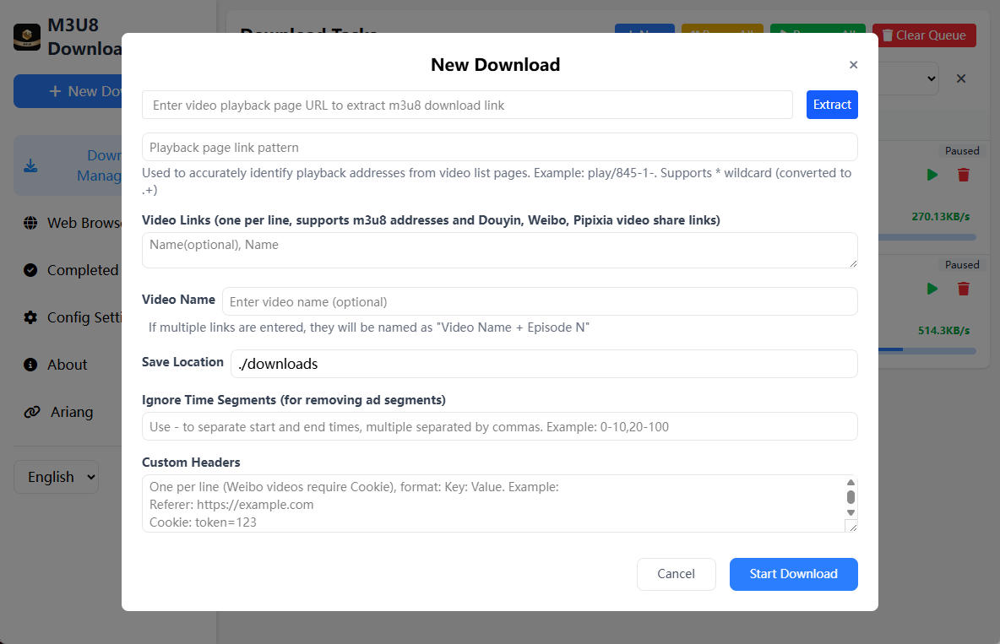
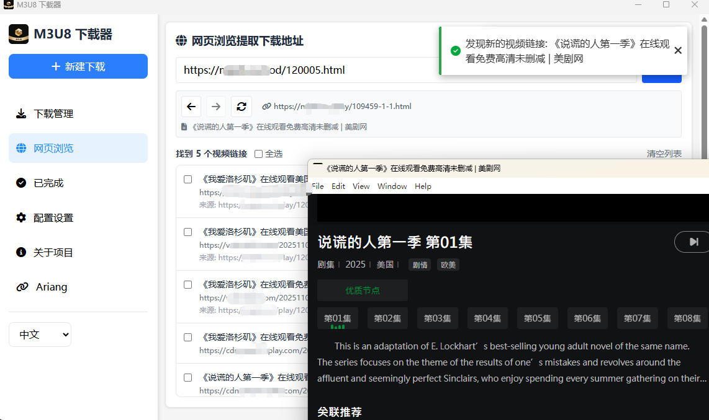
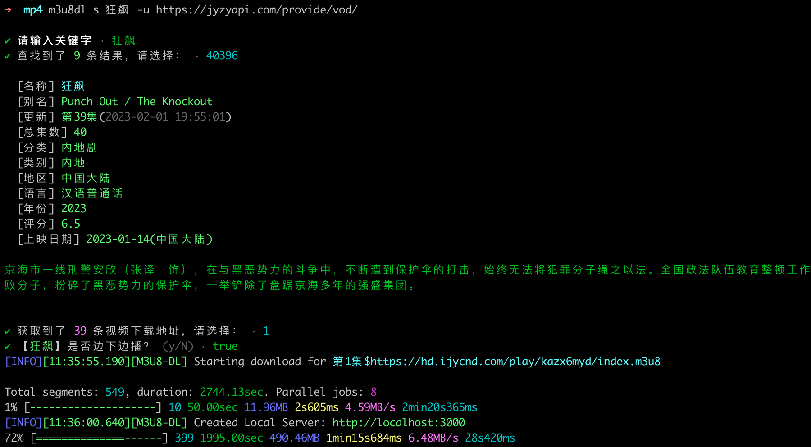
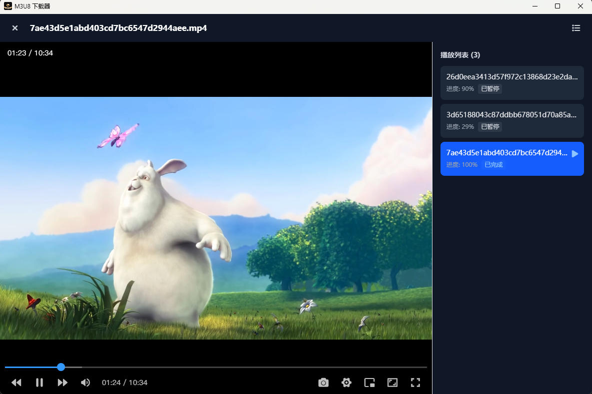

[][npm-url]

# @lzwme/m3u8-dl

[![NPM version][npm-badge]][npm-url]
[![node version][node-badge]][node-url]


[](https://github.com/lzwme/m3u8-dl/actions/workflows/node-ci.yml)
[![npm download][download-badge]][download-url]
[![GitHub issues][issues-badge]][issues-url]
[![GitHub forks][forks-badge]][forks-url]
[![GitHub stars][stars-badge]][stars-url]

> **语言**: [English](README.md) | [中文简体](README.zh-CN.md)

一个免费开源功能强大的 m3u8 视频批量下载工具，支持多线程下载、边下边播、WebUI 管理、视频解析等多种功能。支持 CLI命令行、浏览器、PC客户端、Docker 部署以及 Node.js API 调用等多种使用方式。

## ✨ 功能特性

### 🚀 核心下载功能

- **多线程下载**：采用线程池模式，支持自定义线程数，大幅提升下载速度
- **边下边播模式**：支持使用已下载的 ts 缓存文件在线播放，无需等待完整下载
- **批量下载**：支持指定多个 m3u8 地址批量下载，支持文本文件批量导入
- **缓存续传**：下载失败会保留缓存，重试时只下载失败的片段，节省带宽和时间
- **AES 加密支持**：自动识别并解密常见的 AES-128 加密视频流
- **格式转换**：自动将下载的 ts 片段合并转换为 mp4 格式（需安装 [ffmpeg](https://ffmpeg.org/download.html)）
- **多格式支持**：支持下载 mp4、mkv 等格式的视频文件
- **片段过滤**：支持忽略指定时间段的视频片段（如跳过片头片尾）

### 🌐 WebUI 下载管理

- **现代化界面**：基于 Vue 3 + TypeScript 构建的现代化 Web 界面
- **实时进度**：通过 WebSocket 实时显示下载进度和状态
- **任务管理**：支持暂停、恢复、删除下载任务，支持批量操作
- **下载中心**：集中管理所有下载任务，支持搜索和筛选
- **配置管理**：可视化配置下载参数（线程数、保存目录等）
- **访问控制**：支持设置访问密码（token）保护服务



### 🎬 视频解析功能

- **多平台支持**：支持抖音、微博、皮皮虾等平台的视频分享链接解析
- **无水印下载**：自动提取无水印视频地址并下载
- **智能识别**：自动识别视频平台并选择合适的解析器

### 🔍 m3u8 地址智能提取功能

- **网页提取**：支持从视频播放页面自动提取 m3u8 地址
- **深度搜索**：支持多层级页面搜索，自动发现视频链接
- **批量提取**：一次提取多个视频链接，支持批量下载



### 🎯 浏览器油猴脚本抓取器

- **自动抓取**：自动拦截和抓取网页中的 m3u8 和 mp4 视频链接
- **实时监控**：监控网络请求（XMLHttpRequest、fetch、Performance API），自动发现视频链接
- **智能识别**：自动识别视频类型（M3U8/MP4），并提取视频名称
- **一键跳转**：支持一键跳转到 M3U8-DL WebUI 进行下载
- **灵活配置**：支持配置排除网址规则，避免在特定页面抓取
- **拖拽面板**：支持拖拽移动面板位置，自动保存位置
- **链接管理**：支持复制链接、清空列表等操作

> 这是一个 Violentmonkey/Tampermonkey/Greasemonkey 用户脚本，可在浏览器中自动抓取视频链接，配合 M3U8-DL WebUI 使用，实现无缝下载体验。

### 📺 视频搜索功能

- **采集站支持**：支持标准采集站 API，通过命令行交互搜索和下载
- **缓存机制**：自动缓存搜索历史，支持继续未完成的下载



### ▶️ 视频播放

- **内置播放器**：WebUI、桌面客户端均内置轻量级视频播放器，可直接在线播放已下载的或下载中的视频，无需等待全部完成。
- **边下边播**：支持 ts 缓存片段自动拼接，边下载边可播放，实现“即下即看”体验。
- **多格式支持**：播放器支持 mp4、ts 等主流视频格式播放，并可拖动、倍速、全屏、画中画等操作。
- **历史记录**：自动记录播放进度，可断点续播，方便长视频追剧。

> 无需依赖第三方播放器，即可在浏览器或客户端内直接观看下载内容，提升使用便捷性。



### 💻 多种使用方式

- **命令行工具**：提供完整的 CLI 命令，支持各种参数配置
- **Node.js API**：提供编程接口，方便集成到其他项目
- **Web 服务**：支持启动为 Web 服务，通过浏览器管理下载
- **Docker 部署**：提供 Docker 镜像，一键部署到服务器
- **Electron 桌面应用**：支持打包为桌面应用，包含内置浏览器功能

### 🌍 国际化支持

- 支持中文和英文多语言
- 命令行和 WebUI 均支持语言切换

## 📦 安装

**方式一：使用 Node.js 全局安装**

作为 CLI 命令行工具使用。

```bash
npm i -g @lzwme/m3u8-dl
m3u8dl -h
```

或者使用 `npx` 直接运行：

```bash
npx @lzwme/m3u8-dl -h
```

**方式二：桌面应用下载**

安装为电脑客户端使用。使用难度低，适合大多数普通用户，并且有内置浏览器自动提取视频地址的增强功能。可访问如下地址之一下载最新版本：

- [https://m3u8-player.lzw.me/download.html](https://m3u8-player.lzw.me/download.html)
- [https://github.com/lzwme/m3u8-dl/releases](https://github.com/lzwme/m3u8-dl/releases)

## 📖 使用指南

> **提示**：如需要下载并转换为 `mp4` 视频格式，您需全局安装 [ffmpeg](https://ffmpeg.org/download.html)。
> 或者使用 `--ffmpeg-path` 参数指定 ffmpeg 的路径。

### 作为 CLI 命令行工具使用

查看所有可用命令和选项：

```bash
m3u8dl --help
```

#### 基础下载

```bash
# 下载单个 m3u8 文件
m3u8dl https://example.com/video.m3u8

# 指定文件名和保存目录
m3u8dl https://example.com/video.m3u8 --filename "我的视频" --save-dir "./downloads"

# 启用边下边播模式
m3u8dl https://example.com/video.m3u8 --play

# 设置线程数（默认 4）
m3u8dl https://example.com/video.m3u8 --thread-num 8

# 不转换为 mp4（仅下载 ts 片段）
m3u8dl https://example.com/video.m3u8 --no-convert

# 忽略指定时间片段（如跳过前 30 秒和最后 60 秒）
m3u8dl https://example.com/video.m3u8 --ignore-segments "0-30,END-60"
```

#### 批量下载

**方式一：命令行参数**

```bash
# 下载多个文件，使用 | 分隔文件名和 URL
m3u8dl "第1集|https://example.com/ep1.m3u8" "第2集|https://example.com/ep2.m3u8" --filename "剧集名称"
```

**方式二：文本文件批量导入**

创建 `剧集列表.txt` 文件，格式如下（使用 `$` 分隔文件名和 URL）：

```txt
第1集$https://example.com/ep1.m3u8
第2集$https://example.com/ep2.m3u8
第3集$https://example.com/ep3.m3u8
```

然后执行：

```bash
m3u8dl 剧集列表.txt --filename "剧集名称"
```

#### 视频解析下载

支持抖音、微博等平台的分享链接：

```bash
# 抖音视频分享链接
m3u8dl "https://v.douyin.com/xxxxx/" --type parser

# 微博视频分享链接
m3u8dl "https://weibo.com/xxxxx" --type parser
```

#### 从网页提取 m3u8 地址

```bash
# 从视频播放页面自动提取 m3u8 地址并下载
m3u8dl "https://example.com/play/12345" --type web
```

#### 视频搜索下载

```bash
# 查看搜索命令帮助
m3u8dl search --help

# 指定采集站 API 并搜索下载（会缓存 API 地址）
m3u8dl search -u https://api.example.com/provide/vod/

# 直接搜索关键词
m3u8dl search "关键词" -u https://api.example.com/provide/vod/
```

> **声明**：以上仅作示例，请自行搜索查找可用的采集站 API。本工具仅用作技术研究学习，不提供任何具体资源类信息。

#### 常用命令行选项

| 选项 | 说明 |
|------|------|
| `-f, --filename <name>` | 指定文件名 |
| `-n, --thread-num <number>` | 设置下载线程数（默认 4） |
| `-p, --play` | 启用边下边播模式 |
| `-C, --cache-dir <dirpath>` | 指定缓存目录 |
| `-S, --save-dir <dirpath>` | 指定保存目录 |
| `--no-convert` | 不转换为 mp4 |
| `--no-del-cache` | 下载完成后不删除缓存 |
| `--ffmpeg-path <path>` | 指定 ffmpeg 路径 |
| `-H, --headers <headers>` | 设置请求头（JSON 格式） |
| `-I, --ignore-segments <time>` | 忽略指定时间片段 |
| `--debug` | 启用调试模式 |
| `--lang <lang>` | 设置语言（zh-CN/en） |

### WebUI 下载管理

启动 Web 服务，通过浏览器管理下载任务：

```bash
# 启动服务（默认端口 6600）
m3u8dl server

# 指定端口和访问密码
m3u8dl server -p 8080 -t "your-secret-token"
```

启动后，在浏览器中访问 `http://localhost:6600` 即可使用 WebUI。

**WebUI 主要功能：**

- 📥 创建下载任务（支持 m3u8 链接、微博和皮皮虾视频分享链接、视频播放网页提取）
- 📊 实时查看下载进度和速度
- ⏸️ 暂停/恢复下载任务
- 🗑️ 删除任务和已下载文件
- ⚙️ 配置下载参数（线程数、保存目录等）
- 🔍 搜索和筛选任务
- 📁 查看已完成的下载

**环境变量配置：**

```bash
# 设置端口
export DS_PORT=6600

# 设置访问密码
export DS_SECRET=your-secret-token

# 设置保存目录
export DS_SAVE_DIR=./downloads

# 设置缓存目录
export DS_CACHE_DIR=./cache

# 设置 ffmpeg 路径
export DS_FFMPEG_PATH=/usr/local/bin/ffmpeg

# 启用调试模式
export DS_DEBUG=1

# 限制文件访问（仅允许访问下载和缓存目录）
export DS_LIMTE_FILE_ACCESS=1
```

### 以 Node.js API 形式集成调用

在您的项目中调用相关 API。代码示例：

```ts
import { m3u8Download, m3u8BatchDownload, VideoParser, getM3u8Urls } from '@lzwme/m3u8-dl';

// 示例 1：单文件下载
const result = await m3u8Download('https://example.com/video.m3u8', {
  filename: '我的视频',
  saveDir: './downloads',
  threadNum: 8,
  debug: true,
});

if (result.errmsg) {
  console.error('下载失败：', result.errmsg);
} else {
  console.log('下载成功：', result.filepath);
}

// 示例 2：批量下载
const fileList = [
  '第1集$https://example.com/ep1.m3u8',
  '第2集$https://example.com/ep2.m3u8',
];
await m3u8BatchDownload(fileList, {
  filename: '剧集名称',
  threadNum: 4,
});

// 示例 3：视频解析下载（抖音、微博等）
const parser = new VideoParser();
const parseResult = await parser.parse('https://v.douyin.com/xxxxx/');
if (parseResult.data) {
  console.log('视频标题：', parseResult.data.title);
  console.log('视频地址：', parseResult.data.url);

  // 下载视频
  await parser.download('https://v.douyin.com/xxxxx/', {
    filename: parseResult.data.title,
  });
}

// 示例 4：从网页提取 m3u8 地址
const urls = await getM3u8Urls({
  url: 'https://example.com/play/12345',
  headers: {
    'User-Agent': 'Mozilla/5.0...',
  },
  deep: 2, // 搜索深度
});
console.log('提取到的地址：', Array.from(urls.keys()));

// 示例 5：指定 ffmpeg 路径
import ffmpegStatic from 'ffmpeg-static';
m3u8Download('https://example.com/video.m3u8', {
  filename: '测试视频',
  ffmpegPath: ffmpegStatic, // 使用 ffmpeg-static 包。适合未全局安装 ffmpeg 的场景
  // 或指定已安装的绝对路径（若已在 PATH 环境变量中，则无需指定）
  // ffmpegPath: '/usr/local/bin/ffmpeg',
});
```

### Docker 部署

#### 使用 Docker 命令

```bash
# 拉取镜像
docker pull renxia/m3u8-dl:latest

# 运行容器
docker run --rm -it \
  -v ./cache:/app/cache \
  -v ./downloads:/app/downloads \
  -p 6600:6600 \
  -e DS_PORT=6600 \
  -e DS_SECRET=your-secret-token \
  renxia/m3u8-dl:latest
```

#### 使用 Docker Compose

创建 `docker-compose.yml` 文件：

```yml
services:
  m3u8-dl:
    image: renxia/m3u8-dl:latest
    container_name: m3u8-dl
    volumes:
      - ./downloads:/app/downloads
      - ./cache:/app/cache
    ports:
      - '6600:6600'
    environment:
      DS_PORT: '6600'
      DS_SAVE_DIR: '/app/downloads'
      DS_CACHE_DIR: '/app/cache'
      DS_SECRET: '' # 设置访问密码
      DS_DEBUG: ''
      DS_FFMPEG_PATH: ''  # 留空则使用系统 PATH 中的 ffmpeg
      DS_LIMTE_FILE_ACCESS: '1' # 限制文件访问
    restart: unless-stopped
```

启动服务：

```bash
docker-compose up -d
```

部署成功后，浏览器访问 `http://your-server-ip:6600` 即可使用。

> **提示**：Docker 镜像已包含 ffmpeg，无需额外安装。镜像同时包含了 [AriaNg](https://github.com/mayswind/AriaNg) 静态资源。

### Electron 桌面应用

项目支持打包为 Electron 桌面应用，提供更丰富的功能：

- 🖥️ 原生桌面体验
- 🌐 内置浏览器，支持从网页提取视频链接
- 📱 系统托盘支持
- 🔄 自动更新功能

下载已构建的应用：

- https://m3u8-player.lzw.me/download.html
- https://github.com/lzwme/m3u8-dl/releases

### 浏览器脚本安装与使用

**安装步骤：**

1. 安装浏览器扩展（任选其一）：
   - [Violentmonkey](https://violentmonkey.github.io/)（【推荐】开源替代方案）
   - [Tampermonkey](https://www.tampermonkey.net/)（支持 Chrome、Firefox、Edge、Safari 等）
   - [Greasemonkey](https://www.greasespot.net/)（仅支持 Firefox）

2. 安装脚本：
   - 打开用户脚本管理器（Violentmonkey/Tampermonkey）管理面板
   - 点击"添加新脚本"
   - 复制 `client/m3u8-capture.user.js` 文件内容
   - 粘贴到编辑器中并保存
   - 或者浏览器直接访问链接：[https://raw.githubusercontent.com/lzwme/m3u8-dl/refs/heads/main/client/m3u8-capture.user.js](https://raw.githubusercontent.com/lzwme/m3u8-dl/refs/heads/main/client/m3u8-capture.user.js)

3. 配置 WebUI 地址：
   - 访问任意网页，点击页面右上角的 🎬 图标打开抓取面板
   - 点击设置按钮 ⚙️
   - 输入您的 M3U8-DL WebUI 地址（如 `http://localhost:6600`）
   - 保存设置

**功能说明：**

- **自动抓取**：脚本会自动监控网页中的网络请求，当检测到 m3u8 或 mp4 视频链接时，自动添加到列表中
- **视频名称提取**：优先从页面的 `h1`、`h2` 或 `document.title` 提取视频名称
- **跳转下载**：点击"跳转下载"按钮，会自动跳转到 M3U8-DL WebUI 并填充视频链接和名称（格式：`url|name`）
- **排除规则**：在设置中可以配置排除网址规则列表，匹配的网址将不展示面板且不抓取视频链接
  - 支持普通字符串匹配（包含匹配）
  - 支持正则表达式（以 `/` 开头和结尾，如 `/example\.com/`）

**使用示例：**

1. 访问视频播放页面
2. 脚本自动抓取视频链接，显示在右下角的面板中
3. 点击"跳转下载"按钮
4. 自动跳转到 M3U8-DL 的 WebUI，视频链接和名称已自动填充
5. 在 WebUI 中点击"开始下载"即可

**排除规则配置示例：**

```
localhost:6600
127.0.0.1
/example\.com/
admin
```

> **提示**：脚本会自动排除 WebUI 地址页面，避免在 WebUI 页面中抓取。您也可以手动添加更多排除规则。

## 🛠️ 技术栈

- **后端**：Node.js + TypeScript + Express + WebSocket
- **前端**：Vue 3 + TypeScript + Vite + Pinia + TailwindCSS
- **桌面应用**：Electron
- **代码质量**：Biome (Linter & Formatter)
- **构建工具**：TypeScript Compiler

## 💻 开发指南

### 本地开发

```bash
# 克隆项目
git clone https://github.com/lzwme/m3u8-dl.git
cd m3u8-dl

# 安装依赖
pnpm install

# 开发模式（监听文件变化自动编译）
pnpm dev

# 构建项目
pnpm build

# 代码检查
pnpm lint

# 代码格式化
pnpm format

# 修复代码问题
pnpm fix
```

构建桌面应用（[Electron](https://electronjs.org)）：

```bash
# 进入应用目录
cd packages/m3u8dl-app

# 安装依赖
pnpm install

# 开发模式运行
pnpm dev

# 构建应用
pnpm build
```

构建桌面应用（[Electrobun](https://github.com/blackboardsh/electrobun)，需 [Bun](https://bun.sh)）：

```bash
# 仓库根目录（已 pnpm install）
pnpm run build          # cjs + client
pnpm run dev:app        # Electrobun 开发
pnpm run build:app      # 打包到 packages/m3u8dl-electrobun/artifacts
```

### 项目结构

```
m3u8-dl/
├── src/              # 源代码（TypeScript）
│   ├── cli.ts        # 命令行入口
│   ├── lib/          # 核心库
│   ├── server/       # Web 服务
│   ├── video-parser/ # 视频解析器
│   └── types/        # 类型定义
├── packages/
│   ├── frontend/     # Vue 3 前端项目
│   ├── m3u8dl-app/   # Electron 桌面应用
│   ├── m3u8dl-electrobun/   # Electrobun 桌面壳（Bun）
│   └── m3u8-capture/ # 浏览器油猴脚本（TypeScript + Vite）
├── cjs/              # 编译后的 CommonJS 代码
└── client/           # 前端构建输出
    └── m3u8-capture.user.js  # 浏览器视频地址抓取器油猴脚本（由 packages/m3u8-capture 构建）
```

### 贡献代码

欢迎提交 Issue 和 Pull Request！

1. [Fork](https://github.com/lzwme/m3u8-dl/fork) 本项目
2. 创建特性分支 (`git checkout -b feature/AmazingFeature`)
3. 提交更改 (`git commit -m 'Add some AmazingFeature'`)
4. 推送到分支 (`git push origin feature/AmazingFeature`)
5. 开启 Pull Request

**欢迎贡献想法与代码！** 🎉

## 📚 相关资源

- [ffmpeg 下载](https://ffmpeg.org/download.html) - 视频处理工具
- [m3u8 格式说明](https://en.wikipedia.org/wiki/M3U) - M3U8 播放列表格式
- [项目更新日志](./CHANGELOG.md) - 查看版本更新历史

## 🙏 致谢

感谢以下项目的启发和参考：

- [m3u8-multi-thread-downloader](https://github.com/sahadev/m3u8Downloader)
- [m3u8Utils](https://github.com/liupishui/m3u8Utils)

## License

`@lzwme/m3u8-dl` is released under the MIT license.

该插件由[志文工作室](https://lzw.me)开发和维护。

[stars-badge]: https://img.shields.io/github/stars/lzwme/m3u8-dl.svg
[stars-url]: https://github.com/lzwme/m3u8-dl/stargazers
[forks-badge]: https://img.shields.io/github/forks/lzwme/m3u8-dl.svg
[forks-url]: https://github.com/lzwme/m3u8-dl/network
[issues-badge]: https://img.shields.io/github/issues/lzwme/m3u8-dl.svg
[issues-url]: https://github.com/lzwme/m3u8-dl/issues
[npm-badge]: https://img.shields.io/npm/v/@lzwme/m3u8-dl.svg?style=flat-square
[npm-url]: https://npmjs.com/package/@lzwme/m3u8-dl
[node-badge]: https://img.shields.io/badge/node.js-%3E=_14.18.0-green.svg?style=flat-square
[node-url]: https://nodejs.org/download/
[download-badge]: https://img.shields.io/npm/dm/@lzwme/m3u8-dl.svg?style=flat-square
[download-url]: https://npmjs.com/package/@lzwme/m3u8-dl
[bundlephobia-url]: https://bundlephobia.com/result?p=@lzwme/m3u8-dl@latest
[bundlephobia-badge]: https://badgen.net/bundlephobia/minzip/@lzwme/m3u8-dl@latest
